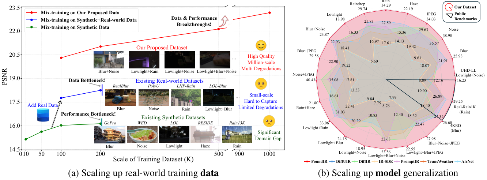
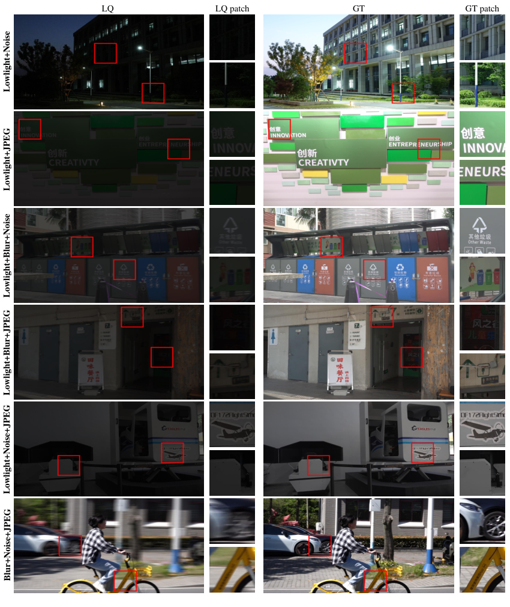
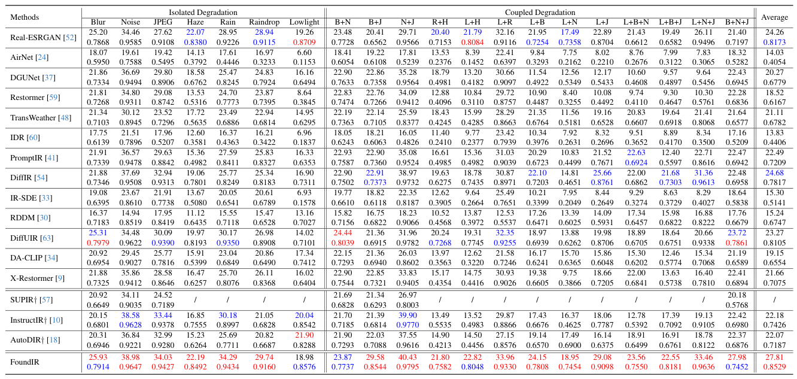
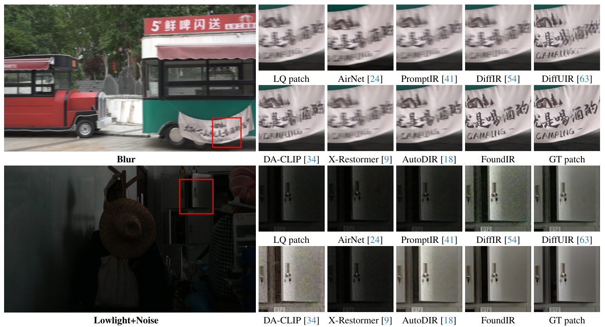

<p align="center">
  
</p>

### FoundIR: Unleashing Million-scale Training Data to Advance Foundation Models for Image Restoration [ICCV 2025]
[](https://github.com/House-Leo/FoundIR)
> [[Project Page](https://www.foundir.net)] &emsp; [[Paper](https://openaccess.thecvf.com/content/ICCV2025/html/Li_FoundIR_Unleashing_Million-scale_Training_Data_to_Advance_Foundation_Models_for_ICCV_2025_paper.html)] &emsp; [[arxiv](https://arxiv.org/abs/2412.01427)] &emsp; [[Supplemental Material](https://drive.google.com/file/d/11JTb6Dqd7RlV4kItOUwsNb43EyodVJYC/view?usp=sharing)] &emsp; [[中文版介绍](https://mp.weixin.qq.com/s/R_UP-hdRYS_2pKlh-Nr8JA)]

> [Hao Li*](https://house-leo.github.io/), [Xiang Chen*](https://cschenxiang.github.io/), [Jiangxin Dong](https://scholar.google.com/citations?user=ruebFVEAAAAJ&hl=zh-CN&oi=ao), [Jinhui Tang](https://scholar.google.com/citations?user=ByBLlEwAAAAJ&hl=zh-CN), [Jinshan Pan](https://jspan.github.io/) <br>
> [IMAG Lab](https://imag-njust.net/), Nanjing University of Science and Technology


Welcome to visit our website (专注底层视觉领域的信息服务平台) for low-level vision: https://lowlevelcv.com/

---
<p align="center">
  
</p>

*The potential of large-scale training data for universal image restoration. (a) Analysis of universal image restoration performance in real-world scenarios as training data vary. As the size of real-world training data increases, the image restoration model can achieve significant performance improvement. (b) Our proposed FoundIR, trained on our million-scale dataset, achieves state-of-the-art performance across a broad range of image restoration tasks compared to existing universal image restoration methods.*

---

<!-- ### Coming soon. -->

### 🚩 **New Features/Updates**
- ✅ July, 07, 2025. Release the training set. Please fill out the [request form](https://docs.google.com/forms/d/e/1FAIpQLSfogNyffKcT_lV_eMS1r76nDFfF7mEzOsiP8SDvjVpS2-EqqQ/viewform?usp=header) to get the download link!
- ✅ July, 02, 2025. Release the training code and [script](#computer-training)! 
- ✅ June 26, 2025. 🎉 Our FoundIR was accepted by **ICCV 2025**!
- ✅ May 13, 2025. Update the script for calculating the metrics, including PSNR, SSIM, LPIPS, FID, CLIP-IQA, MANIQA, MUSIQ, NIQE, NIMA. Thanks to the awesome [pyiqa](https://github.com/chaofengc/IQA-PyTorch).
- ✅ February 18, 2025. Release the testing code and pre-trained models of the specialist models, the testset (GT) on [Google Drive (GT)](https://drive.google.com/file/d/1KjRZcyA1THRzHZhX2yTGMtOdUW_wuGsI/view?usp=sharing), and the visual results on [Google Drive (FoundIR)](https://drive.google.com/file/d/1MLSV4OPvictpKYsDdqF7LcjnIebYYNUw/view?usp=sharing) and [Baidu Yun (Others)](https://pan.baidu.com/s/1ORZVrHkgsVMymSSI4Yng-g?pwd=b6qb).
- ✅ February 05, 2025. Release the testing code and [pre-trained model](https://github.com/House-Leo/FoundIR/releases/download/Premodel/model-2000.pt) of the generalist model, and the testset (LQ) on [Google Drive (LQ)](https://drive.google.com/file/d/1wOaquAjnuzCh6Jv3CJz76mgnx4nfZgBY/view?usp=sharing).
- ✅ December 03, 2024. Release [paper](https://arxiv.org/abs/2412.01427) and [supplemental material](https://drive.google.com/file/d/11JTb6Dqd7RlV4kItOUwsNb43EyodVJYC/view?usp=sharing).
- ✅ November 22, 2024. Creat the repository and the [project page](https://www.foundir.net).

### ⚡ **To Do**
- [x] Release training code
- [x] Release training dataset
<!-- - Release testing code and pre-trained models of the specialist models -->

---

### :book: Dataset

#### Testset & Visual Results (Table 1)

|Benchmark|GT|LQ|FoundIR|Compared methods|
|:-|:-:|:-:|:-:|:-:|
|Download Link|[Google Drive](https://drive.google.com/file/d/1KjRZcyA1THRzHZhX2yTGMtOdUW_wuGsI/view?usp=sharing)|[Google Drive](https://drive.google.com/file/d/1wOaquAjnuzCh6Jv3CJz76mgnx4nfZgBY/view?usp=sharing)|[Google Drive](https://drive.google.com/file/d/1MLSV4OPvictpKYsDdqF7LcjnIebYYNUw/view?usp=sharing)|[Baidu Yun (pw: b6qb)](https://pan.baidu.com/s/1ORZVrHkgsVMymSSI4Yng-g?pwd=b6qb)|

<!-- **The visual results of other compared methods can be found in [Baidu Yun (pw: b6qb)](https://pan.baidu.com/s/1ORZVrHkgsVMymSSI4Yng-g?pwd=b6qb).** -->

**The public data results of Table 2 can be found in [Baidu Yun (pw: 58vg)](https://pan.baidu.com/s/1sLchdjD-UwFGFrT5GMPGTQ?pwd=58vg).**

#### Training Set

**The total size of the training set is nearly 4.85 TB. Make sure you have enough space on your hard disk to unzip the data.**

|Training Set|GT&LQ|
|:-|:-:|
|Download Link|[Request Form](https://docs.google.com/forms/d/e/1FAIpQLSfogNyffKcT_lV_eMS1r76nDFfF7mEzOsiP8SDvjVpS2-EqqQ/viewform?usp=header)|



**More samples can be found in the [supplemental material](https://drive.google.com/file/d/11JTb6Dqd7RlV4kItOUwsNb43EyodVJYC/view?usp=sharing) (P7-P9).**

---

### :computer: Evaluation

#### :arrow_right: Environment
```
conda env create -f environment.yml
```

#### :arrow_right: Testing the Generalist Model
- Download the [pre-trained model](https://github.com/House-Leo/FoundIR/releases/download/Premodel/model-2000.pt) and put it in the `./premodel` folder.

<details open>
<summary><b>For our testset:</b></summary>

- download the [testset](#testset--visual-results) and organize them as follows:

```
    |--dataset
    |    |--01Blur
    |    |    |--GT
    |    |    |    |--0001.png
    |    |    |    |--0002.png
    |    |    |    |...
    |    |    |--LQ
    |    |    |    |--0001.png
    |    |    |    |--0002.png
    |    |    |    |...
    |    |--02Blur_Noise
    |    |    |--GT
    |    |    |    |--0151.png
    |    |    |    |--0152.png
    |    |    |    |...
    |    |    |--LQ
    |    |    |    |--0151.png
    |    |    |    |--0152.png
    |    |    |    |...
    |    | ...
```
- Run the following command to test the generalist model.
```
python test.py --dataroot ./dataset --meta ./Testset_meta_info.txt
```
</details>

<details close>

<summary><b>For your own data:</b></summary>

- Put the testset in the `./dataset/LQ` folder (simply copy the LQ folder and rename it `GT` if you don't have GT images.).
- Recomment L40-L44 in `test.py` to test your own data.
```
## For our testset
# dataset = CombinedDataset(opt, image_size, augment_flip=False, equalizeHist=True, crop_patch=False, generation=False, task='meta_info')

## For your own data
dataset = CombinedDataset(opt, image_size, augment_flip=False, equalizeHist=True, crop_patch=False, generation=False, task=None)
```
- Run the following command to test the generalist model.
```
python test.py --dataroot ./dataset --meta None
```

</details>

**(If you have a GPU with less than 24GB, you can reduce the `crop_size` on `test.py` L102.)**

#### :arrow_right: Testing the Specialist Models (Optional)
We provide two specialist models, i.e., **Lowlight** and **Weather** models, to refine the results of the generalist model.

In our experiments, we refine the generalist model's outputs as follows:
```
Weather model: 0501-0700 and 1051-1100 inputs
Lowlight model: 0701-0800, 1101-1250, and 1301-1500 inputs
```

**Please note that this is optional**, allowing you to further refine the generalist model’s outputs using the following commands, especially for challenging **lowlight, hazy, and rainy** inputs.

- Install the environment.
```
cd ./specialist_model
pip install -r requirements.txt
python setup.py develop
```
- Put the testset in the `./dataset` folder.
- Run the following command to test the specialist models.
```
python inference_lowlight.py
or
python inference_weather.py
```
And you can find the output visual results in the folder `results/`.

#### :arrow_right: Evaluation Metrics
- Install the [pyiqa](https://github.com/chaofengc/IQA-PyTorch) package. Thanks to [Chaofeng Chen](https://github.com/chaofengc).
```
pip install pyiqa
```
- Run the following command to calculate the metrics.
```
python cal_metrics.py --inp_imgs ./dataset/restored --gt_imgs ./dataset/GT --log ptah_save_log
```

---
### :computer: Training

Our FoundIR is trained in two stages, please follow the steps in `train.sh` to train the model.
```
sh train.sh
```

---

### Results
- **Quantitative Results**


- **Qualitative Results**


**More qualitative results can be found in the [supplemental material](https://drive.google.com/file/d/11JTb6Dqd7RlV4kItOUwsNb43EyodVJYC/view?usp=sharing) (P10-P37).**

---

### Citation
If this work is helpful for your research, please consider citing the following BibTeX entry.
```
@inproceedings{li2024foundir,
      title={FoundIR: Unleashing Million-scale Training Data to Advance Foundation Models for Image Restoration},
      author={Li, Hao and Chen, Xiang and Dong, Jiangxin and Tang, Jinhui and Pan, Jinshan},
      booktitle={ICCV},
      year={2025}
}
 ```

### Acknowledgement
We would like to thank our team members (*Hao Chen, Yinghui Fang, Jiashuo Liu, Ke Wu, Renyuan Situ, ...*) for their contributions in data collection and post-processing of this work.

### Contact
If you have any questions, please feel free to reach us out at <a href="mailto:haoli@njust.edu.cn">haoli@njust.edu.cn</a> and <a href="mailto:chenxiang@njust.edu.cn">chenxiang@njust.edu.cn</a>.
